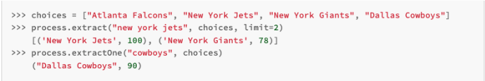

## Programming Assignment One

### Overview
An online marketplace is an e-commerce site that brings sellers and buyers together in one place. It allows sellers to 
put  items  for  sale  and  interested  buyers  to  purchase  those  items.

### Architecture
Components:
- Buyer
    - Buyer-Client-Interface
    - Buyer-Server-Interface
- Seller
    - Seller-Client-Interface
    - Seller-Server-Interface
- Storage
    - Database-Server

To support multi-client server architecture I have used the “selectors” module from python.<br>
This module allows high-level and efficient I/O multiplexing, built upon the select module primitives.

#### Storage
- This component contains two functionailty - Database server and Database Connection Utility
- Database Utility initializes the database and creates the required tables.
- It also creates the connection object to the database, that can be shared across components.
- The Database server can be started by executing the "db_server.py"
- Once the initialization is complete it starts listening to accept connections.

#### Seller and Buyer
- This component contains the client and server interface.
- Client
    - The client can be started by executing the "<seller/buyer>-client.py"
    - As part of initialization, it connects to the server using TCP/IP and registers this connection using selectors and also sets the event mode (READ/WRITE).
    - Once the initialization is complete, It starts accepting inputs from the user.
    - Client Interface takes care of validating the input, If the input schema doesnt match, It will throw a validation error.
    - If the input passes the validation, The input is encoded and passed to the server.
    - When the client receives the response from the server, It decodes the messsage and prints it in the client user interface.
    - Using the logging module, The response time for each API is logged to "<seller/buyer>_response_time.log" inside the logs folder.
- Server
    - The server can be started by executing the  "<seller/buyer>-client.py"
    - As part of initalization, it fetches the database connection object from storage component and starts listening for connections from client.
    - When the client tries to establish a connection, It accepts the connection and registers the connection using selector with event mode.
    - It initializes the server-interface object and stores the object in the map. MAP<CONNECTION_OBJECT,SERVER_INTERFACE_OBJECT>
    - When the client sends the messgage, It fetches the server object from the map and the object starts processing the message.
    - The server object will take care of invoking the appropritate API based on the op_code.
    - After the message is processed, API returns a response object which is passed back to the client.
    - In case of database operations, The server objects sends the request to the storage component using the connection object.
    - In order to calculate the server throughout, The server processing time is logged to "<seller/buyer>_server_throughput.log" inside the logs folder.
#### Semantics for Keyword search:
For this functionality, I am using the existing python package “fuzzywuzzy” which calculates the matching score given a word and a list of words.
It uses Levenshtein Distance to calculate the differences between sequences.<br>


#### Current state
The source code is divided according to the components mentioned above.<br>

- Functionalities
    - Buyer component supports the following functionalities
        - Acount Creation
        - Login
        - Logout
        - Search items for sale
        - Add item to cart
        - Remove item from cart
        - Clear cart
        - Display cart
        - Get Seller Rating
    - Seller component supports the following functionalites
        - Account Creation
        - Login
        - Logout
        - Get Seller Rating
        - Add Item for Sale
        - Update Item Sale Price
        - Remove Item from Sale
        - Display All Items Posted by Seller
- Input Format
    - It is required to follow a certain format while passing input through the client interface. <br>
        ```
        {
            "op_code": <OPERATION_CODE>,
            "value": <VALUE>,
            "action": <OPERATION_NAME>
        }
        ```
    - Sample input for seller and buyer can be found inside the corresponding module. "<seller/buyer>_input.json"
- Execution and Evaluation Script
    - Both seller and buyer modules contains the script to test different scenarios.
    - Execution scripts invokes all the apis based on the input.json and invokes one particular API based on op_code for 1000 times.
    - Evaluation script creates 'n' instances using process pool executor and invokes the execution script.
    - Combining both the scripts, we can run 'n' instances and each instance invoking one api 1000 times for performance evaluation.
    - Usage
        - Start the database server - db_server.py
        - Start the seller server - seller-server.py
        - Start the buyer server - buyer-server.py
        - Run the evaluation script from corresponding module.
        ```
            - python3 evaluation_script.py <NO_OF_CLIENT_WORKERS>
            - e.g. python3 evaluation_script.py 10 ## For 10 instances of buyer or seller 
        ```
- TODOs
    - Implement the following APIs for buyer
        - Make purchase
        - Provide Feedback
        - Get buyer purchase history
- Logs
    - Response time and Throughput time is logged for every api to log file inside logs folder.
- Assumptions
    - Server takes care of validating the authenticity of the request
    - New TCP connection is made for every database operation.
    - Any operation can be performed by ther user only after login. SessionID is stored in-memory.
    - All the tables are currently part of one database.
    - Added 'cart' table to the database to make the client stateless.